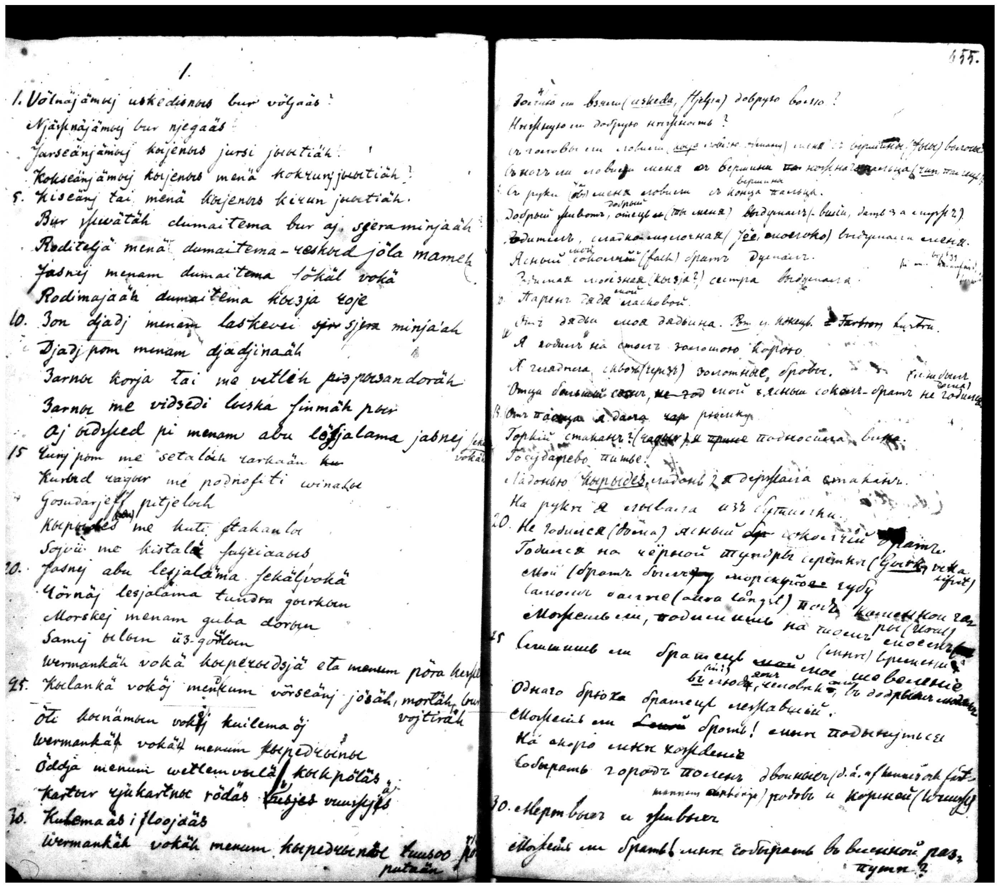
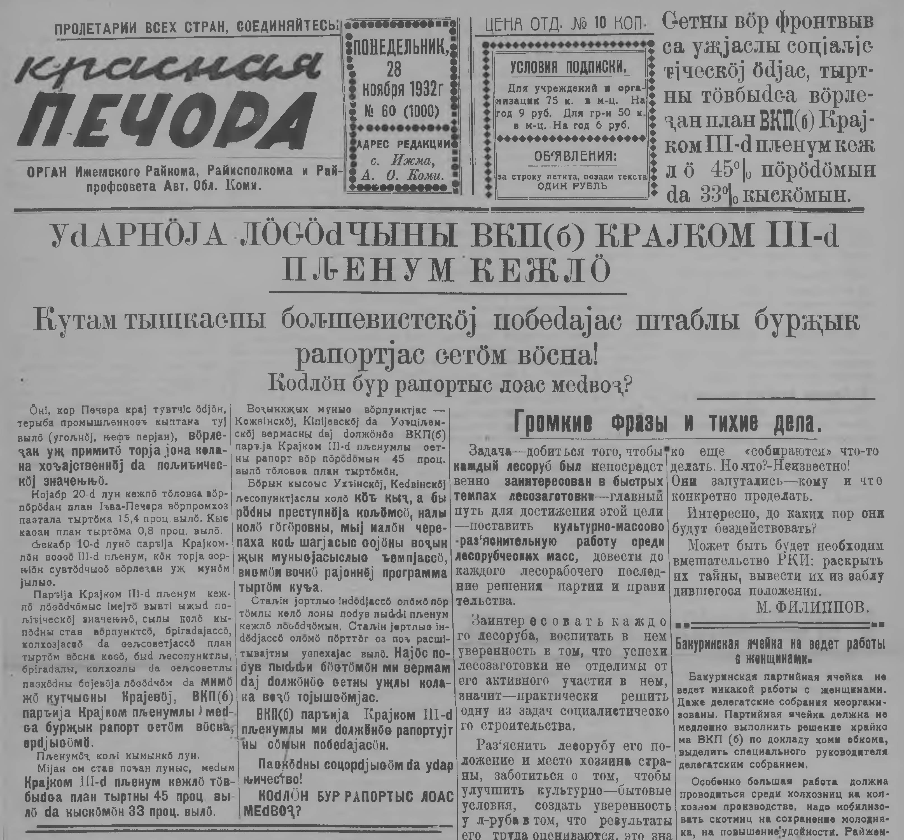
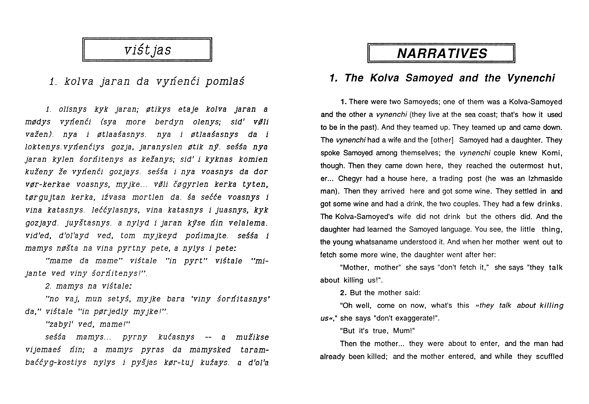
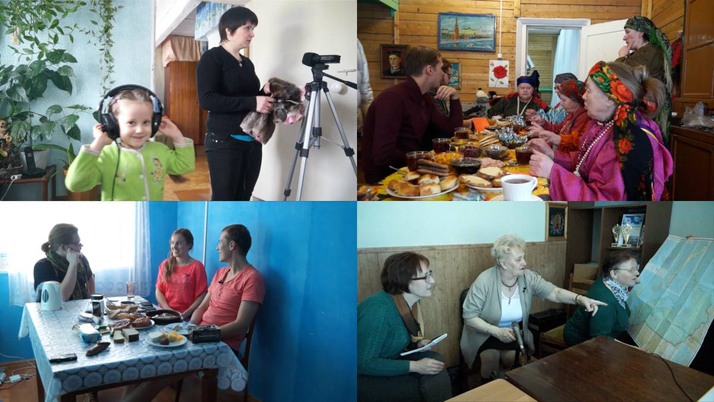
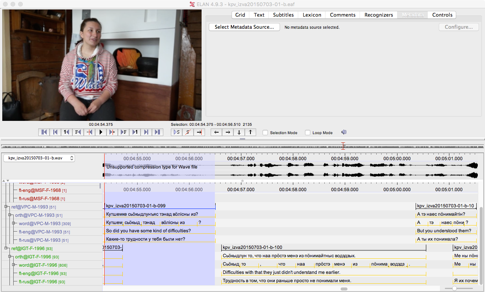
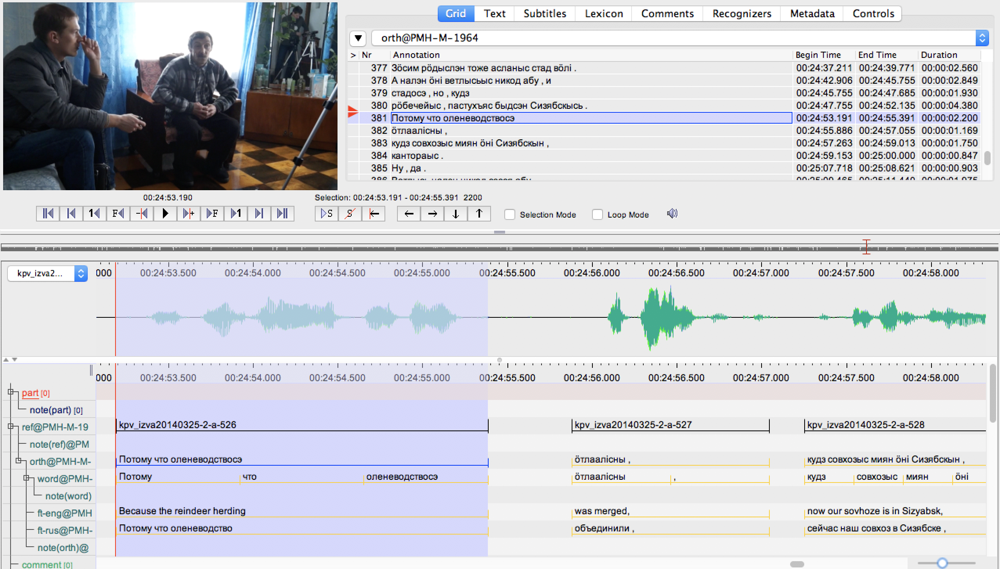
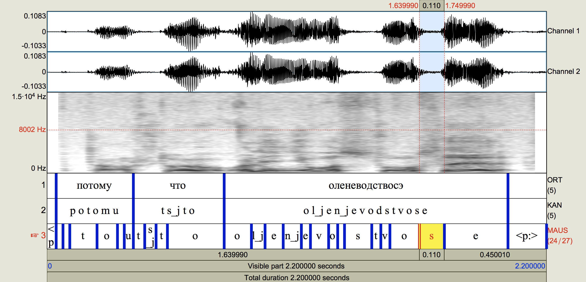
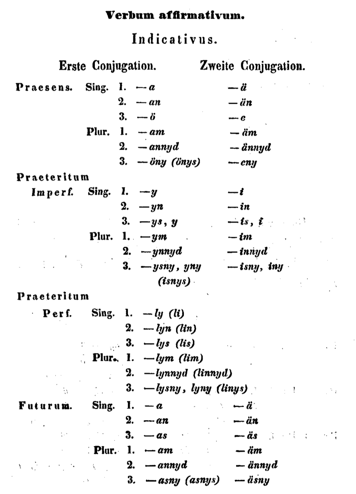
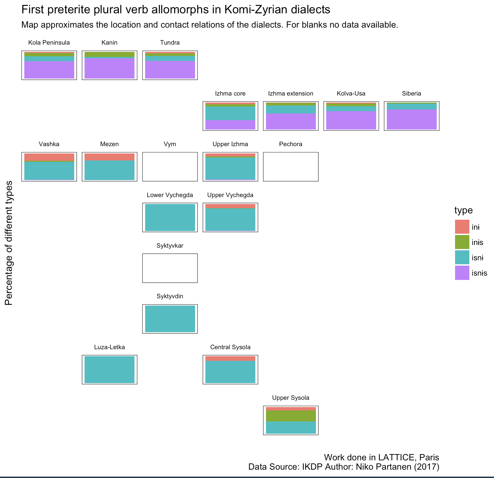

```{r setup, include=FALSE}
options(htmltools.dir.version = FALSE, echo=FALSE)
library(tidyverse)
```

## Background

- I started working with Komi language in 2011
- After my MA in University of Helsinki in 2013 I worked in Germany and now in Paris
   - Some work in Germany not related to my PhD
- In 2014--2016 there was a project working with one Komi dialect
- For 2017--2019 we got a continuation project


## My dissertation

- Topic of my PhD is variation in Komi dialects
    - Relates to language contact, partly sociolinguistically motivated
    - Deliminated by … 
        - … what we can say with existing data
        - … what kind of annotations we can realistically add
        - … which processes can be automatized with sufficient quality
        - … etc

## Talk's structure

- What's Komi language?
- Outcome of IKDP project
- Plans for the IKDP2 project
- Work done in Paris
- Current state of my PhD (vague deadline is in 2019)
    - Russian influence in Komi
    - Phonetic changes
    - Morphosyntactic changes
    - Better analysis of syntactic structures should follow

## Komi language

- Uralic language
- Three varieties: Komi-Zyrian, Komi-Permyak, Komi-Jazva
- Closely related to Udmurt, more distantly to Finnish, Hungarian etc.
- Around 300,000 speakers, everyone bilingual in Russian
- Spoken by children in several regions
- Language shift in the cities fast

##

```{r, echo=FALSE, warning=FALSE, message=FALSE, comment=FALSE, fig.align='center'}
library(sf)
library(leaflet)

kom <- sf::st_read('https://raw.githubusercontent.com/nikopartanen/language_maps/master/geojson/kom.geojson', 
                   quiet = TRUE)

komi_map <- leaflet() %>% addTiles() %>% addPolygons(data = kom, stroke = 0, fillOpacity = 0.8) %>%
  addPolygons(data = kom %>% filter(lang == 'koi'), fillColor = 'yellow', stroke = 0, fillOpacity = 0.8) %>%
  addPolygons(data = kom %>% filter(lang == 'koi-j'), fillColor = 'green', stroke = 0, fillOpacity = 0.8)

```

<center>
`r komi_map`
</center>

```{r, echo=FALSE, warning=FALSE, message=FALSE, comment=FALSE}
# kom <- sf::st_read('https://raw.githubusercontent.com/nikopartanen/language_maps/master/geojson/kom.geojson', 
#                    quiet = TRUE)
# yrk <- sf::st_read('https://raw.githubusercontent.com/nikopartanen/language_maps/master/geojson/yrk.geojson', 
#                    quiet = TRUE)
# mns <- sf::st_read('https://raw.githubusercontent.com/nikopartanen/language_maps/master/geojson/mns.geojson', 
#                    quiet = TRUE)
# kca <- sf::st_read('https://raw.githubusercontent.com/nikopartanen/language_maps/master/geojson/kca.geojson', 
#                    quiet = TRUE)
# sjd <- sf::st_read('https://raw.githubusercontent.com/nikopartanen/language_maps/master/geojson/sjd.geojson', 
#                    quiet = TRUE)

komi_map2 <- komi_map %>%
    addPolygons(data = kom %>% filter(dial == 'izva'), stroke = 0, fillColor = 'red', fillOpacity = 0.8)
  # addPolygons(data = yrk, stroke = 0, fillOpacity = 0.5) %>%
  # addPolygons(data = mns, stroke = 0, fillOpacity = 0.5) %>%
  # addPolygons(data = kca, stroke = 0, fillOpacity = 0.5) # %>%
#  addPolygons(data = sjd, stroke = 0, fillOpacity = 0.5)

# leaflet() %>% addTiles() %>% addPolygons(data = sjd, stroke = 0, fillOpacity = 0.5)

```

## Dialects

- Historical expansion from south to north
- Around 10-14 varieties, each splitting to few subvarieties
- Areal spread related to the river systems
- Written language based to central Syktyvkar dialect
    - Often exhibits dialectal features
- Komi-Zyrian and Komi-Permyak mutually intelligible 
- Official support of Komi-Zyrian much wider than Komi-Permyak's
- Komi-Jazva under-researched and seriously endangered, some materials exist in Russian institutions in Perm and Syktyvkar

##

<center>
`r komi_map2`
</center>

## IKDP

- The project aimed to produce generally useful dataset from Iźva dialect
    - Not built with individual research question in mind
    - Tries to be areally and demographically (little bit) balanced
- Fieldwork in four locations, covering most of the areas except Siberia
- Results in almost 300,000 transcribed words
- Lots of focus in metadata and systematizing old data

## M.A. Castrén's notes

<center>

</center>

## Red Pechora newspaper

<center>

</center>

## Eric Vászolyi's collections

<center>

</center>

## IKDP data

<center>

</center>

## Annotation model

- Unusually for a language documentation project, the annotations were shallow
- As far as was possible, the English or Russian translations were provided
- Rather large percentage of utterances are in Russian, or contain different Russian segments
- This is not to say that we don't need the annotations!

## Recording 20150703-01

<center>

</center>

## Other sources

- The availibity of Komi materials has been growing also otherwise
- Fenno-Ugria collection has produced thousands of digitalized books and newspaper (Red Pechora etc.)
- Marina Fedina's [laboratory](http://fu-lab.ru/) in Syktyvkar has been proofreading and digitalizing books
- Some online corpora exist as well
- Restructuring old materials is a never ending task
    - One way to fill gaps in current data

## Corpus structure

### Original layers

- Time aligned transcriptions
- Raw data, regularly adds into transcriptions

### Subcorpora

- Manually corrected phoneme-aligned utterances 
- Manually annotated syntactic dependencies
- Semi-manually annotated POS-tagged subcorpus


## Language technology

- Forced alignation to match phonemes and utterances
- Automatic segmentation tools to get materials transcribed faster
- Morphological and syntactic annotations
    - Rule-based analysators
    - Statistical SEM parser
    - Machine learning based [Multilingual Bist-parser](https://github.com/jujbob/multilingual-bist-parser)

## Niko's PhD

- Majority of Iźva Komi's expansion has taken place in last 200 years
    - Komis settled to Muži in 1843, to Kola Peninsula in 1880s 
- Internal variety in the dialect must be relatively new
- Usually connects to geographic isolation and/or language contact


- Phonetic differences easiest to access as the existing annotation layer captures those partially
- Within morphology there are differences in frequencies of allomorphs
- We assume there is quite much syntactic variation


- Current studies have also been test cases for the corpus -> used to select new materials

## Topic: Russian influence in Komi

- Already studied, but there have not been corpus based investigations [@leinonen2009a]
- My recent work has discussed this from:
    - Adaptation of Russian phonology
    - Morphological changes and patterns 
    - Word order changes
        - Especially written and spoken Komi differ in this
        - There are syntactic structures in Komi, which prefer OV construction although usually the word order is described as SVO
- As contact has been so long, the way borrowing takes place has strongly conventionalized

## Permic sibilant system

```{r, echo=FALSE}
sibs <- tibble::tibble(voiceless = c('s', 'ɕ', 'ʃ'),
       voiced = c('z', 'ʑ', 'ʒ'))
  
suppressWarnings(row.names(sibs) <- c('alveolar', 'alveolo-palatal', 'palato-alveolar'))

sibs %>% knitr::kable()
```

## Current dialectal sibilant system

```{r, echo=FALSE}
sibs <- tibble(voiceless = c('s', 'sʲ', 'ʃ'),
       voiced = c('z', 'zʲ', 'ʒ'))
  
suppressWarnings(row.names(sibs) <- c('alveolar', 'alveolar (palatalized)', 'palato-alveolar'))

sibs %>% knitr::kable()

```

##

- Similar development in numerous dialects
    - Upper Sysola
    - Ińva (Komi-Permyak)
    - All have exceptionally long or intensive contact with Russian

- In Iźva (roughly) areally restricted to Siberia, Kola Peninsula, Kanin Peninsula
- Co-occurs and overlaps with other developments inside Iźva (parallels in other dialects)
    - Deaffricatization, metathesis etc.

##

<!--kpv_izva20111014VVF-1-->

```{r, echo=FALSE, message=FALSE}
tribble(~transcription, ~translation,
        'vot nalən sʲələm, sʲələm da, vot menam zev una mɨjkə,', 'Well they say “heart”, “heart”, yes, I have many (examples).',
'i najə viɕtalənɨ “mi praviʎna ɕorɲitam, mi koʎim vaʒsə”', 'And they say: “We speak correctly, we retained the old (way)”,', 
'me ʃua “kuʧəma ti praviʎnəja?”',	'and I say: “how do you speak correctly?”',
'a seni eməɕ ətkɨmɨn jəz kodjas',	'And there are some people who,',
'ʃuam pərɨɕʤɨkjas, i naja mian moznas ɕorɲitənɨ.',	'let’s say the older, and they speak in our way.',
'a tomjasɨs uʒe nalən sʲəʎəm, puksʲɨ, vot sidʒi najə uʒe ɕorɲitənɨ', 'But the youngs, they already have “heart”, “sit down”, well this is how they already speak.',
'da, sɨ vösna mɨj nalən ötɨk rot͡ɕ vlʲejanije',	'Yes, because they have one Russian influence.',
'məd kə vidʲimo xantɨ mansʲi ɲeɲeckəjɨs toʒə kuʧəmakə petkət͡ɕːə',	'On the other hand Khanty, Mansi and Nenets (influence) comes out.') %>% knitr::kable()
```


## EMU-system

- Uses segmentation tools developed in [Institute of Phonetics and Speech Processing of the University of Munich](http://ips-lmu.github.io/)
- Has existing models for Russian segmentation
- Can be accessed through [emuR R package](http://ips-lmu.github.io/EMU.html)
- I've used it through a simple mapping between Komi and Russian phoneme inventories
    - Doesn't come without problems

##

<center>

</center>

##

<center>

</center>

##

- I'm currently analysing the phonetic properties of these sibilants
- The standard pronunciation on some area
- Associated with Russian
- I use the information about Russian origin of the lexical item as one variable


- The core Izhma area lacks many features that are common on tundra areas
- However, the local reindeer herders do exhibit these in their speech
- This feature is **not** among these ones

## Example from morphological variation

- Verbs in past tense can occur with several allomorphs
    - isny ~ isnys ~ iny ~ inys
    - Example: мунісны ~ мунісныс ~ муніны ~ муніныс
- To some degree areal, but variation present in many dialects
- Iźva is possibly the only dialect with all four variants in use
- Ideas to test: transitivity, presence of object, phonotaxis, syllable stress, age-graded variation, register choices, sociolinguistic differences etc.
- Current descriptions of Komi are good, but there are gaps

##

<center>

</center>


##

<center>
`r komi_map`
</center>

##

<center>

</center>


## Multilingual Bist-parser

- Developed mainly by KyungTae Lim, based on a monolingual parser [@limEtAl2017a]
- We have experimented with combining Russian and Finnish corpora into training models that are applied to Komi data
    - Results have been promising
    - For now the Finnish model has outperformed the others

- Possibly especially useful with data that contains both Russian and Komi
- Other approach is to do language identification beforehand

## References